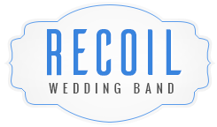
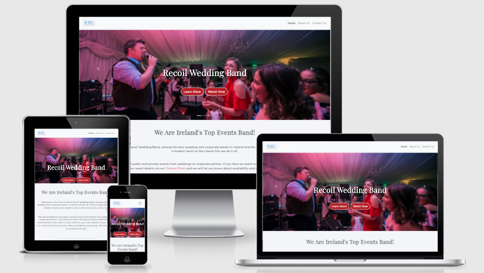
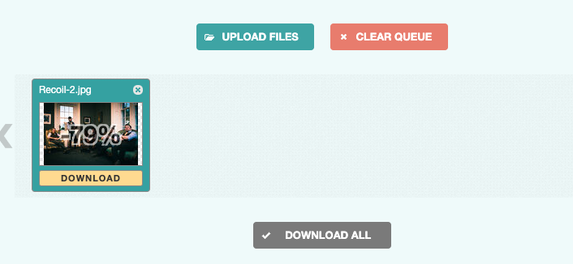
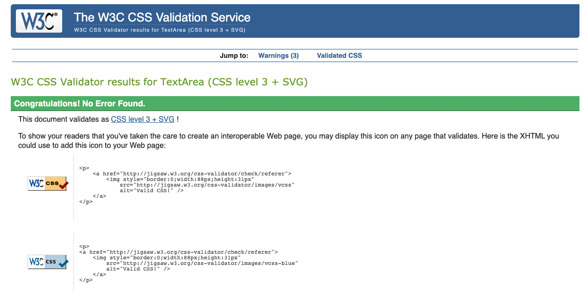
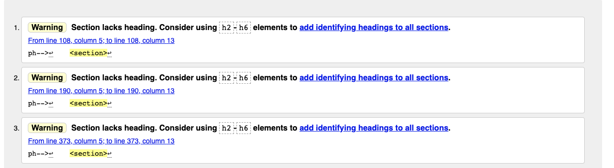
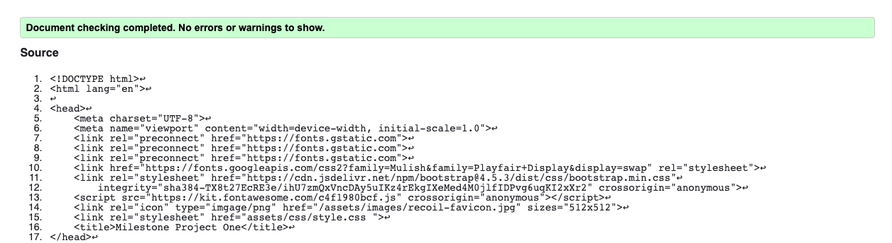
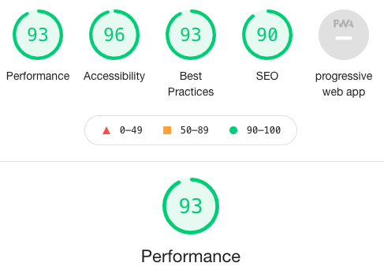

# Milestone Project 1

This project is based on a corporate events / wedding band that has a growing fan base in Ireland and the Uk. It is actually my own band that I set up 10 years ago but is no longer together and does not have an existing website.
I had alot of images and videos from different events of which I am the owner. I worked as a musician in the wedding and corporate events industry for almost 15 years and I was delighted to see this as an option for my first milestone project.

The main objectives for the site are to book more gigs and also gain more followers on social media. 
To achieve these goals I have included emotive and visual content to grab the users attention.
The site's layout allows for easy navigation to guide the user towards the best information that will lead to a conversion in the form of a direct booking or a contact form enquiry.

## [View Live Project](https://joe2308.github.io/milestone-1-test-run/)

# CONTENT QUICK LINKS
## [UX](#ux)
## [FEATURES](#available-features)
## [TECHNOLOGIES](#technologies-used)
## [TESTING](#testing-steps)
## [MEDIA](#media-credits)
## [CREDITS](#code-credits)
## [DEPLOYMENT](#deployment-and-testing)
## [ACKNOWLEDGEMENTS](#my-acknowledgements)

# UX

## UX Mock Ups:
To keep in line with the style expected from weddings and corporate events I have kept the website design simple and clean with the main background being white with black text that is well spaced. 
I have relied on exciting images of live music and a red theme for the call to action buttons. 
I have used a fixed scrolling navigation menu to minimize user scrolling

The following link shows the mockups designed using [Balsamiq wireframes](assets/wireframes/mockups.pdf)

### User Stories:
1. #### As a company HR assistant - I am looking to book exciting corporate entertainment for an upcoming social or team building event.
1. #### As a wedding couple - we are looking to book great live entertainment for our wedding reception.
1. #### As Fan - I would like to find out more about the band and where to find and follow them on social media.

## Strategy:
### What am I making?
A website that offers insight to fans and potential clients about an events band. 

### Website business goals:
1. Get more fans on social media. 
1. Get more people to attend gigs and showcases. 
1. Ultimately get more bookings and revenue.

### Website target audience:
1. Corporate functions 
1. Wedding couples. 

### User value:
It will make booking live entertainment for an event hassle free in the least amount steps possible.

### What users can expect:
1. Quality entertainment showcased in a great video. 
1. No fuss swift booking. 
1. Entertaining background knowledge on the band.

### What is worth doing:
1. Embedding a video showcasing the band's energy and talent. 
1. A contact form for more bookings. 
1. Use of call to action buttons to guide the user towards a conversion.
1. Quality images and interesting content about the band.

### Single use learning:
I made this website easy to navigate and intuitive for first time users.
The content is laid out to allow for the least possible steps to a conversion booking. 

### What makes it a good experience:
1. Simple outlay. 
1. Emotive images.
1. Exciting video.
1. Lots of background info on band members. 
1. Simple navigation.
1. Easy to book and contact the band directly.

### Where would a user go first and why?
First time users will be most engaged by the live video.
The video conveys what the band's performance will be like for the user's upcoming event.

### How do I initiate an impulse buy/booking?
Feel good content with CTA flow to lead to completing the booking form or at the very least follow the band on social media.

## Scope:

### Features for this release:
1. video
1. Contact form
1. Upcoming show sticker
1. Emotive images 
1. Rich informative content on the band
1. Social media links

### User requirements:
1. The ability to see a live video
1. The ability to attend live showcases
1. The ability to contact the band
1. The ability to read rich content
1. The ability to follow the band on social media 
1. The ability to view images

### How we will achieve these requirements:
1. By adding a video to home page of a live performance
1. By showing the next event details on a landing page
1. By implementing a contact form
1. Good headings and paragraphs that are informative and enjoyable to read
1. Appropriate social links in the footer and also by use of natural internal links in the content
1. Each page will have a hero image and also each section on each page will begin with an image

## Structure:

### Navigation
I have implemented a single page site of 3 sectons:
1. Home
1. About Us
1. Contact Us
1. The header also contains the band logo which has a return to home link.

I have used a fixed navigation bar to allow users to move to any other section from their current section. 
This creates a better user experience and avoids excessive scrolling. I have also implemented the use of embedding text links throughout sections of content that relates to other important content internally and externally such as the band's social media platforms.
The linking stucture keeps my user experience strategy in mind of generating conversions through contact form enquiries and social media followers.

## Skeleton:

### Presentation
1. Simple layout
1. Hero image for each section
1. Fixed navigation
1. Consistent layout and theme

### User conventional tools:
1. Clear headings 
1. Clickable elements clearly labelled 
1. Easy to read nav bar 
1. Social media links in the form of clickable icons in the footer. 

### Progressive disclosure:
I have placed the priority content on the home page so the user sees this first.
I have arranged the supporting content in order of priority in additional sections. 
Each section links to the most important items to engage users and encourage a conversion.

### Elements that have priority:
1. Navigation menu with fixed scrolling
1. Clickable logo with return to home link
1. Video and hero images 
1. Social media links
1. Contact form

## Surface

### Colors:
My theme has been kept extremely simple and is based on a white wedding.
Background colors have been kept to shades of white and off whites and silvers. The CTA buttons are a shade of deep red.
These colors convey the prominent themes of a traditional wedding. 
When brainstorming the main themes of a wedding the following things came to mind:
1. Wedding dress - Usually white and off white colors (main background theme)
1. Love - The most conventional symbol is the heart - red in color (Used on all CTA buttons)
2. Dining with friends and family - A huge part of a wedding is sitting down to an extravagant meal with loved ones and the first thing that came to my mind was cutlery.
I have used light greys and silvers in some sections to convey this.

### Fonts:
- For the headings I have used Playfair display in uppercase for its elegant style.
Headings that are on a background image are white to stand out more. And headings over paragraph sections have been left black.
- For the main text I have used Mulish with a back up of sans-serif at 18px. 
I used Mulish as it is very legible and also pairs well with Playfair Display.

### Images: 
All images have been taken from a live performance by a professional photographer called Mark Duffy.
The images are bright and vibrant and really bring a sense of what a live performance by Recoil will be like for a potential client.

### Order and sequence:
1. Navigation order - Home/ About Us/ Contact US
1. Home section order - Hero image carousel/ Heading/ Intro paragraph/ Video
1. About Us section order - Hero image/  Heading and intro paragraph/ Meet the band profiles
1. Contact Us section order - Hero image/ Heading and paragraph/ Contact form/ Why us?
1. Footer section order - Band name/ social links/ contact details/ copyright

### Other themes:
1. Use of musical instrument icons from font Awesome for the meet the band section
1. Use of subtle shadows to lift some elements off the page

# AVAILABLE FEATURES

### Home
The home page gives an over all synopsis on the band and also contains a video. The main goal is to encourage users to book through the contact form so I have embedded a link in the paragraph text to peak user interest and encourage an enquiry.
The home page consists of a bootstrap carousel of three hero images of the band performing live. As well as studying the bootstrap documentation I found a very helpfull YouTube video to help with this function. I have placed a "Learn More" CTA button to click directly to the contact form over the image and also another "Watch Now" CTA that brings the user to the video section.
The video on the home page encourages enagement and I have also embedded an external link below the video to the band's YouTube channel to encourage new suscribers.

### About us
The About US section consists of a hero image that contains details of the band's next show. To implement the next show sticker I found Code Institute's [Love Running](https://learn.codeinstitute.net/courses/course-v1:CodeInstitute+CSE101+2020_Q2/courseware/be0e510a3aca4bccb6e0bba4cf7cf06b/83c6c94d55f44c79a3646810d80ce7a3/) module very helpfull. 
The hero image also contains a "Meet the band" CTA button which brings the user to informative biographies on each band member. 
I have embedded an external link to the band's Facebook page to encourage new followers and the link text flows naturally with the context of the content. 
The band member profile again encourages engagement by bringing forth new information on each member. This is an interesting addition for both fans of the band and new users.

### Contact US 
The Contact Us section includes a hero image with a CTA button that brings the user directly to a simple contact form. Just three steps are available; Name> Email> Message. 
My intent to keep the contact form as simple as possible was to minimize cognitive overload and encourage users to reach out with either a direct booking being generated or a more general enquiry regarding price or upcoming shows. 
A direct booking is the preferred outcome but I regard a general enquiry as a successful conversion as from here a narrative can begin with the band managment and a percentage of general enquiries can be seduced to a confirmed booking.

### Footer
I have added social media links and contact details in the footer. All footer location icons are clickable and work in external tabs.
I also added copyright details in a seperate bootstrap collumn. I played around with bootstrap's grid breakpoints to see what worked best on what devices.
Aswell as referring to bootstrap documentation I also found a very usefull YouTube video to help me implement the style I was looking for, please see credits for more details.
I then added my personal style preference in css.

### Features to add for future releases:
There are some features that I would love to implement on future releases:

#### 1. Availability calender - Allow the user to get instant feedback on availability by inputting their event details
#### 1. Live chat - This would be a great support option to engage with new users and reduce bounce rate and increase session times
#### 1. Virtual showcases - In today's world this would be an amazing option which would include an upcoming show notice and count down timer with the option for users to book their attendance to a virtual showcase. Users who have booked will be emailed a zoom link and a reminder notification when the show is about to start.

# TECHNOLOGIES USED

1. [Balsamiq](https://balsamiq.com/wireframes/)
* I found Balsamiq an extremely usefull platform to design mock ups and get a feel of how my website would look before coding.

1. [HTML 5](https://en.wikipedia.org/wiki/HTML)
* HTML is the main mark up language used to design my webiste.

2. [CSS 3](https://en.wikipedia.org/wiki/CSS)
* All HTML element were syled to my own personal taste using CSS language.

3. [Bootstrap 4](https://getbootstrap.com/docs/4.5/getting-started/introduction/)
* In order to make my website responsive I used the bootstrap 4 grid system. I also used bootstrap to help with my image carousel.

4. [Font Awesome](https://fontawesome.com/)
* All icons have been sourced and added from the free version of font awesome.

5. [Google Fonts](https://fonts.google.com/)
* I used google fonts to source both Playfair Display and Mulish to syle all of my headings and text.

6. [Gitpod](https://www.gitpod.io/)
* I used git pod as my IDE workspace to write and run all code. I used Git as my version control to commit and push all code to my GitHub repository.

1. [Github](https://github.com/)
* I used GitHub to store my Git commits and back up all code.

1. [W3C HTML validator](https://validator.w3.org/)
* I used the W3C validation service to ensure all HTML code passed validation.

1. [W3C CSS validator](https://jigsaw.w3.org/css-validator/)
* I used the W3C validation service to ensure all CSS code passed validation.

1. [Photoshop](https://www.adobe.com/ie/products/photoshop.html)
* I used Adobe photoshop to create the band logo and favicon.

1. [Youtube](https://www.youtube.com/)
* I used YouTube to embed the video using iframes.

1. [Optimizilla](https://imagecompressor.com/)
* When testing load speeds in Lighthouse some of my images needed to be optimized. Optimizilla allowed me to compress images up to 80% dramatically improving the website's performance in Lighthouse.

1. [Chrome Developer Tools](https://developers.google.com/web/tools/chrome-devtools)
* Throughout the development process I used chrome developer tools for debugging and also to keep checking any changes I was making looked good on all devices.

# TESTING STEPS

## User story testing:

1. **As a HR assistant for a large company** I have been tasked with booking a professional band for the companies summer barbeque. 
Having searched some keywords on google the website for Recoil Wedding Band catches my eye. The website is quick to load and the landing page has an eye catching image of a well dressed five piece act that look like professionals in their field.
I am intrigued. The landing page hero image has a button that says "Watch Now" on clicking I am brought to a very slick and professional video of the band showcasing an amazing performance of songs that will definatley fill the dancefloor.
I am tempted to get in touch and on clicking Contact US I am presented with a simple three step contact form. I input my event details and a swift reply on availability allows me to book there and then.

1. **As a bride** seeking the perfect band to entertain my guests at my wedding reception I begin my online search. On entering the Recoil Wedding Band website I find the layout simple, elegant and easy to navigate.
The text content is not overwheling yet it is informative. I would like to see and hear how the band sounds. The "Watch Now" button brings me to an excellent live video. From here I am interested in finding out more about each band member.
The fixed navigation means I never have to scroll to the top and the menu is always one click away. I click on About Us and I am brought to a meet the band section that has a photo and bio on each band member. Having felt I have gotten to know the band I now would like to get in touch. I click on the "Get in Touch" button below the meet the band section and I am brought to a contact form.
I fill out the form and begin correspondance with the band.

1. **As a fan** I would like to know more about Recoil Wedding Band and when they have their next show. On scrolling the website and reading lots of informative information
there are many embedded links in the text that bring me to other resources such as the band's YouTube channel. I have never seen some of the videos on there and decide to like and suscribe I also tell my friends about it.
These links open in external tabs so finding my way back to the website is easy. In the About Us section I could cleary see a notice about the band's next upcoming show and I made a note in my calender. In the footer I find Social media icons and on clicking I find the band has a strong presence on Facebook and Instagram. There is also extra content on here that I have never seen before so I like and suscribe and also tell my friends about it.
The next time I visit the band's social media I notice their fanbase has grown rapidly.

## Manual Testing:

#### Responsive design:
* I carried out exstensive user testing and consistently checked links and screen sizes on all available devices in Chrome dev tools.
* It was important for me to keep the mobile design as close to desktop as possible. To achieve this I used media queries to reduce font sizes on Hero image titles while also adjusting the hero image sizes.
* I had to move my call to action buttons slightly on smaller screens until I achieved a design I liked while not cluttering my images.
* On screens 280px I used a media query to remove one CTA button from my carousel as it was too clutterd and did not look correct.

#### Call to action buttons:
* I checked and rechecked all buttons were working on all devices and were leading to the correct sections of the website. It was also important that I laid out 
my CTA choices in order of priorty to my user stories with a button to find a live video and a button for the contact form being the most important.

#### Bootstrap break points:
I applied media queries for my font awesome icons to display in block format on smaller screens and I checked this on all devices.

#### Contact form:
I used a background image of spotlights which I made in photoshop to give and effect of lighting up the contact form. 
This looked great on desktop and larger devices however it looked cluttered on smaller screens so I decided to used a simple background color on small devices and implemented this with a media query.
I also exstensively tested the contact form. Making sure all of my "required" attributes were working. The form would not send if a field was left empty or did not contain the correct format of information such as a valid email address.

#### External links:
I made sure to check that all links and social media links were directed to the correct URLS and also that my target="_blank" attribute was working. 
All external links open in a new browser tab.

#### Email and phone:
I also added a **mailto:** link and a **telephone:** link to a working email address and phone number and tested to make sure they were working.
When clicked the email icon opens my email tab and the emails are sending to the assigned source. When the phone icon is clicked my desktop opens skype and my mobile makes a direct call.

## HTML and CSS validation and fixes:
1. I used [W3C CSS validation service](https://jigsaw.w3.org/css-validator/validator) to test and check my CSS code. I luckily had no issues to find and fix. 

1. I used [W3C HTML validation service](https://validator.w3.org/) to test and check my HTML code. There were some errors with not enough headings as seen in image. 

1. I went through all my Headings and semantic elements and corrected the issues.

#### Lighthouse performance test:
1. I used Lighthouse in Chrome devtools to test my website's performance. I was able to dramatically increased load times by optimizing images.
However there were some other points I would like to improve on such as lazy loading of iframes and caching large files. I did do some research on these items however I just did not have enough time to implement and learn them all.
I also increased my best practises score by adding rel="noreferrer" to all external links.

#### Color contrast:
1. I tested my webiste in [WAVE Web](https://wave.webaim.org/)
It did show up some errors on color contrasting on my h1 titles overlayed on images and also my call to action buttons.
I tried to change colors however I really wanted my site to have clean white headings over images.
In order to help them stand out I used linear grading to darken images in css while also adding a minimal text shadow to headings to help them stand out more.

# DEPLOYMENT AND TESTING 

# MEDIA CREDITS
All images and videos are property of Recoil Wedding Band. 
The video was filmed on location in Cork and edited by [Epic Productions](https://www.facebook.com/EpicProductionsIreland/)

Images were taken by [Mark Duffy Photography](https://www.markduffyphotography.com/)

# CODE CREDITS

## [How to resize iframes using bootstrap](https://blog.theodo.com/2018/01/responsive-iframes-css-trick/)

## [How to center an iframe](https://www.panayiotisgeorgiou.net/how-to-center-a-youtube-iframe-on-a-page/)

## [Fixed nav/ responsive nav/ image carousel](https://youtu.be/9cKsq14Kfsw)

## [Responsive footer tutorial](https://youtu.be/Ie59s2wZYc8)

## [Love Running hero image](https://learn.codeinstitute.net/courses/course-v1:CodeInstitute+CSE101+2020_Q2/courseware/be0e510a3aca4bccb6e0bba4cf7cf06b/83c6c94d55f44c79a3646810d80ce7a3/)

# MY ACKNOWLEDGEMENTS
1. I created this website for my old band Recoil who are no longer in operation. 
1. I would like to acknowledge my mentor [Guido Cecilio](https://code-institute-room.slack.com/team/U4ALPK7UG) for his help with the design 
and contact form and any issues I had along the way.
1. I would like to acknowledge [Natasha Clerkin](https://github.com/natashaclerkin/singularartistsMS1) for inspiration from her fantastic README.md file 

